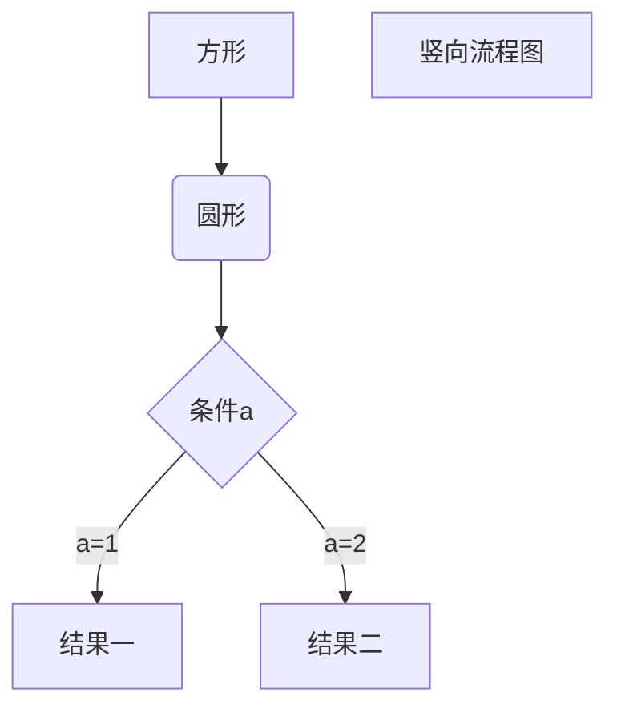
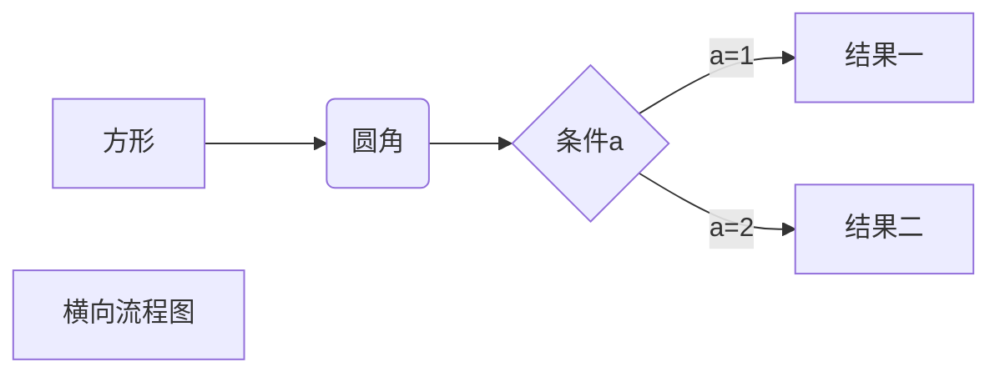

# 流程图

## 流程图格式

```
带方向的的流程图
​```mermaid
	graph 流程图方向
	流程图内容
​```
标准的流程图
​```
	st=>start:开始框
	op=>operation:处理框
	cond=>condition:判断框
	sub1=>subroutine:子流程
	io=>inputoutput:输入输出框
	e=>end:结束框
​```
```

## 流程图的方向

- TB从上到下
- BT从下到上
- RL从右到左
- LR从左到右
- TD同TB

## 基本图形

+ id+[文字描述]矩形
+ id+(文字描述)圆角矩形
+ id+文字描述]不对称矩形
+ id+{文字描述}菱形
+ id+((文字描述))圆形

## 节点之间的连接

* a-->b a带箭头指向b
* a---b a不带箭头指向b
* a-.-b a虚线指向b
* a-.->b a带箭头的虚线指向b
* a==>b a带加粗箭头指向b
* a--描述--b a不带箭头加描述向b
* a--描述-->b a带箭头加上描述指向b
* a--.描述.-->b a带虚线箭头加上描述指向b
* a==描述==>b a带加粗箭头加上描述指向b

## 自定义样式


## demo1

```flow
st=>start: 开始框
op=>operation: 处理框
cond=>condition: 判断框(是或否?)
sub1=>subroutine: 子流程
io=>inputoutput: 输入输出框
e=>end: 结束框
st->op->cond
cond(yes)->io->e
cond(no)->sub1(right)->op
```


## demo2



## demo3




## demo4

``` flow
st=>start: 开始框
op=>operation: 处理框
cond=>condition: 判断框(是或否?)
sub1=>subroutine: 子流程
io=>inputoutput: 输入输出框
e=>end: 结束框
st(right)->op(right)->cond
cond(yes)->io(bottom)->e
cond(no)->sub1(right)->op
```

